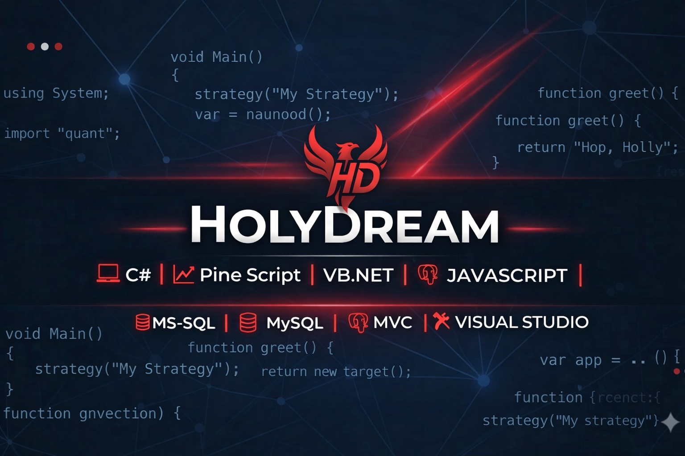

<!-- ======================= BANNER ======================= -->

  

<h1 align="center">HoLyDreaM</h1>
<h3 align="center">R&D Engineer | Advanced Trading Systems | .NET Architect</h3>

---

## 👨‍💼 Professional Profile

Experienced R&D-focused software engineer specializing in:

- Quantitative Finance Systems
- Algorithmic Trading Infrastructure
- High-Performance Backend Engineering
- Automotive Thermal & Material R&D (Engineering Background)

Bridging software architecture with real-world industrial systems.

---

## 🏗 Core Competencies

- Enterprise-Level .NET Architectures
- Scalable Distributed Systems
- Data-Driven Decision Engines
- SQL-Based High Volume Data Management
- Real-Time Processing Pipelines

---

## 🧠 Technical Expertise

- C#
- ASP.NET MVC
- .NET Core / .NET 8
- SQL Server Optimization
- Clean Architecture
- Microservice Deployment Strategies

---

## 🎯 Strategic Focus

- Production-ready AI Trading Systems
- Risk-managed execution engines
- Performance benchmarking & optimization
- Industrial R&D process digitalization

---

## 📊 Engineering Approach

✔ Structured & Data-Driven  
✔ Performance & Stability Focused  
✔ Long-Term Maintainable Architecture  
✔ Scalable Infrastructure Planning  

---

## 📫 Contact

- LinkedIn: (ekle)
- Website: (ekle)
